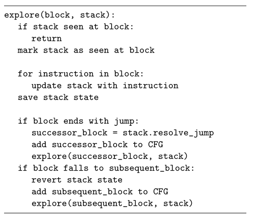
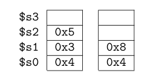
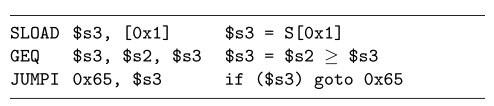
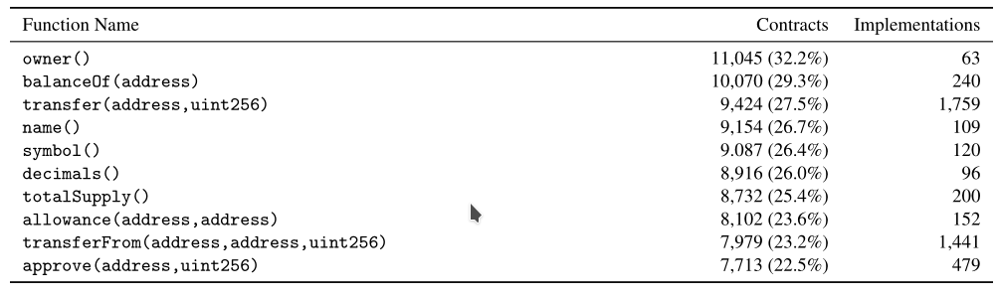

> [sec18-zhou Erays: Reverse Engineering Ethereum’s Opaque Smart Contracts](https://www.usenix.org/system/files/conference/usenixsecurity18/sec18-zhou.pdf)

# Paper Review

## 问题背景

​	与智能合约交互可能会损害个人财产，为了保证合约的正确性与安全性，管控机关希望能审计这些合约，但审计没有源代码的合约是困难的，目前有一些工具能帮助审计，但这些合约对于审计人员来说还是显得有些模糊不清。为了解决这个问题，开发了Erays，一个针对智能合约的逆向工具：它将以太坊区块链中的智能合约作为输入，然后产生相应的高抽象层次的便于人工分析的伪代码。

## 核心思路

​	智能合约就是一段字节码，它是在虚拟环境EVM上运行的，EVM有其对应的指令集，我们将字节码首先还原为相应的汇编代码，然后将该汇编代码一步步精简还原到高抽象层次的伪代码，大致步骤如下：

* 首先反汇编，然后识别基本块
* 得到控制流图CFG
* 提升：将EVM汇编简单改造，改为基于寄存器的形式，并增加一些指令，以便简化我们的代码
* 优化：主要是识别变量，删除无用代码等
* 聚合：用更加接近高级语言的形式将多个指令结合到一起
* 控制流结构恢复：采用结构分析算法恢复高级语言的程序结构
* 最后验证得到的代码是否正确

## 解决方案

### 背景知识

* 区块链与电子货币
* 以太坊的智能合约 (smart contract)
  * 除了用户账号，以太坊还有一类合约账号(contract accounts)，一个合约账号和某段可执行代码关联，合约账号约占所有账号的5%，参与31.2%的交易记录，拥有9.4%的以太币
  * 合约账号的代码执行：用户提交一笔交易，交易对象是合约账号，交易中含有负载数据作为合约账号代码的输入。
  * 合约是多个函数的集合，用户可以调用这些函数，一个合约可以触发另一个合约的执行 (通过CALL指令)
  * 为防止资源过度消耗，用户生成一笔交易必须支付一定的gas (用ether支付gas fee)，按照执行的每个操作码opcode进行计算
  * 合约在一个虚拟环境中执行——EVM (Ethereum Virtual Machine)，其上运行的二进制代码叫做EVM字节码，大概包含150个操作码，EVM是基于栈的机器，操作码从栈中读写数据，EVM还提供memory和storage——memory用来在执行时存储临时的变量，storage用来储存长久的变量(就是生命周期是否能跨交易)。storage中的变量都是通过key来索引，key是一个256-bit的值 (one EVM-word)
  * 开发者通常用高级语言编写合约代码，然后将代码编译为EVM字节码，目前最受欢迎的编写Ethereum smart contracts的语言是Solidity
* Ethereum-based tokens
  * 除了以太币，以太坊也保存有很多"tokens"，就是可以用来交易的物品。它们是建立在智能合约上的。

### 智能合约中的不透明(Opacity)

* 每个合约的字节码是公开的，但字节码是不便于我们阅读与理解的，进而限制了我们对该合约的理解。我们先分析有多少的合约是不能直接得到源代码的，然后看这些合约在这个生态中的重要性。
* 收集了1024886个合约，不重复的只有34328(占总数的3%左右)，在这些不同的合约中，有26594个是不透明的，7734个是透明的，不透明的占了77.3%，但只参与了31.6%的交易，含有25.9%的以太币
  * 
  * 为了知道合约是否有对应的源代码，使用了Etherscan收集verified合约(Solidity files)，然后将它们编译
* 通过比较，发现1M个合约实例中，有965K不能找到相应匹配的源代码(96.5%)，在34K个不同的合约中，能找到匹配的有7.7K (22.7%)，也就是说有77.3%的不同的合约都是未知的。
* 那么这77.3%的合约重要性怎么样呢？两个指标：每个合约账号中存储的以太币多少，每个合约账号的交易笔数
  * 结果表明在这个以太坊的生态环境中，透明占主导地位，但还是有12.7M笔的交易以及$3.1B USD的以太币是审计人员不太了解的。

### 系统设计

* 反汇编与基本块识别
  * 输入是十六进制编码的合约
  * 首先通过简单的线性扫描将十六进制串转换为对应的EVM指令
  * 然后将指令组织成一个个基本块，具体方法是通过两条简单规则：改变控制流的指令标志着块的结束，特殊指令JUMPDEST标志着块的开始。当所有的块入口与块出口都标记完毕，基本块的划分也就完成了
  * 
* 控制流图CFG (control flow graph)的恢复
  * CFG是一个有向图，每个节点表示一个基本块，每条边表示一个程序分支（从某个块到某个块），这需要我们为每个基本块找到其后继块
  * 具体方法是观察该块的最后一条指令，三种情况
    1. 不改变控制流：控制流简单地走到下一个基本块，也就成为我们的后继块
    2. 运行结束(STOP, REVERT, INVALID, RETURN, SELFDESTRUCT)：没有后继块
    3. 分支跳转(JUMP, JUMPI)：取决于跳转指令的目标地址，有的目标地址直接就在代码中——叫做直接分支，有的在栈中——叫做间接分支。
  * 为了处理间接分支的情况，在CFG恢复的算法中模拟栈的状态
  * 
* 提升
  * 将EVM的基于栈的指令提升（转换）为基于寄存器的指令，基于寄存器的指令保留了大多原来的操作方式，加入了少量操作，便于更简洁易懂地表示
* INTCALL, INTRET: 它们分别负责内部函数的调用与返回，不像外部函数通过CALL来调用，内部函数隐含地使用JUMP指令，我们启发式地发现内部函数调用，让我们能进一步精简CFG
  * ASSERT: 和很多高级语言一样，该指令用来验证一个条件语句，solidify编译器添加了一些安全检查到每个编译的合约中，为了精简，删除多余的基本块，我们将这些检查替换为assert语句
  * NEQ, GEQ, LEQ, SL, SR: 这些指令对应不等于，大于等于，小于等于，左移与右移。虽然这些指令不在EVM指令集中，但它们的功能很常用，有了它们，我们能合并更多的EVM指令。
  * MOVE: 把某常量或寄存器中的值复制到另一个寄存器，把SWAP, DUP和PUSH指令都改为了MOVE指令
  * 为了得到指令操作的寄存器，把栈中的每一个word与一个寄存器对应，从\$s0到\$s1023，因为EVM栈最大为1024个words，另外还增加了\$m与\$t两个寄存器，分别用于保存free memory pointer与临时变量(比如在SWAP时需要的临时变量)，所以为了能正确地读写寄存器，栈的高度必须已知，如下图表示了指令`ADD $s1, $s2, $s1`的过程。
  * 
* 优化
  * 将我们的中间代码进一步优化，主要利用数据流优化，包括常量合并，常量传递，复制传递还有无效代码删除等。这些优化都是为了能进一步简化代码，大多的EVM指令都是用在了操作栈上，所以提升的指令中有很多的MOVE指令，优化阶段能将许多多余的代码删除掉。
* 聚合
  * 聚合目的是进一步简化中间表示，将它们替换为等价的，更简练的形式，更加接近高级语言。
  * 比如将下面这个三地址码形式表示的指令，精简为了一条语句
  * 
  * 
* 控制流结构恢复
  * 我们采用结构分析算法来恢复高级程序控制结构，比如while语句，if then else语句等
* 验证
  * Erays将合约转换为了更加易读的表达式，为了能安心地使用它们，我们必须要验证这个转化的正确性：对于某个输入的合约，我们通过执行我们转换的语句来观察是否和原合约一致

## 实验结果

### 分析以太坊生态系统

* 代码复杂程度与复用情况：收集了34K不同的合约，其中26K (77.3%)没有现成的源代码，这些合约与12.7M笔交易有关，含有$3B USD
* 复杂性：发现合约大小稳步增长，但复杂度确是下降或者是稳定趋势
* 代码复用：发现有好些函数能在许多的合约中找到，但这些常见的函数通常对我们没有太大意义，它们主要都是一些公共的getter函数，用来获取某个类型数据用的。进一步研究外部函数，然后统计它们的实现方式个数，前10结果如下：
* 
* 可以看出，尽管它们在许多合约中出现，但是实现方式并没有那么多。

### 将没有源代码的合约与已知的源代码联系起来

* 使用了一个模糊哈希("fuzzy hash")的方法来比较两个合约：平均每个未知的合约能映射出50%的函数与14.7%的指令，让我们立马对该合约有个部分了解

### 案例研究

* 展示如何将Erays作为一个逆向工具应用到4个地方：high-value multi-signature wallets, arbitrage bots, exchange accounts和Cryptokitties (a popular smart contract game)
* 金融服务内部使用的访问控制策略通常是不公开的，但我们展示表明审计这些实现在合约上的策略也是有可能的
* 发现智能合约的开发人员可能想不公开源代码，能有一种类似模糊的方式来保证安全性，但这样的想法是不正确的，代码不透明并不意味着应用就是安全的。

## 可能存在问题

* Erays不是一个完整的反编译器，它不能产生可以再编译的Solidity代码.
* 常见类型的显示没有什么问题，但是对于复杂类型，比如mapping(unit => string)则不能够简单地显示

## 进一步研究方向

* Erays使用的简单结构分析来恢复程序结构，可以有后续工作对其进行改进，如iterative refinement和pattern-independent structuring
* Erays没有做变量恢复与类型恢复，以往有人做过x86架构上的类似工作，尽管使用的不同的指令集，Erays也可以从中借鉴一些东西。